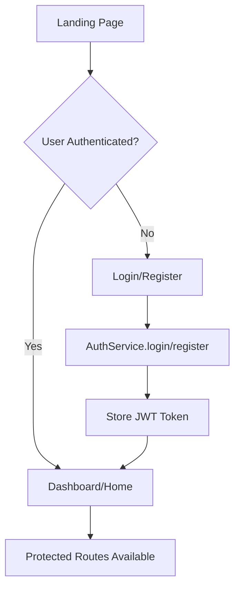

# PetSetGo Frontend Implementation Documentation

## Table of Contents
1. [Project Overview](#project-overview)
2. [Architecture & Tech Stack](#architecture--tech-stack)
3. [Application Flow](#application-flow)
4. [API Integration Status](#api-integration-status)
5. [Page-by-Page Breakdown](#page-by-page-breakdown)
6. [Service Layer Analysis](#service-layer-analysis)
7. [Issues and Bugs](#issues-and-bugs)
8. [Future Development Roadmap](#future-development-roadmap)
9. [Setup and Configuration](#setup-and-configuration)

---

## Project Overview

**PetSetGo** is a comprehensive pet care management platform built with React and Vite. The application provides features for pet management, breeding coordination, community forums, medical records, and veterinary resources.

### Key Features Implemented
- ✅ User Authentication (JWT-based)
- ✅ Pet Profile Management
- ✅ Pet Adoption System
- ✅ Breeding & Mating Services
- ✅ Community Forum
- ✅ Medical Records Management
- ✅ Veterinary Articles
- ✅ File Upload System
- ✅ Responsive UI with Animations

---

## Architecture & Tech Stack

### Frontend Technologies
```json
{
  "core": {
    "React": "^18.3.1",
    "React Router DOM": "^7.1.3",
    "Vite": "^6.0.5"
  },
  "styling": {
    "Tailwind CSS": "^4.0.1",
    "Framer Motion": "^11.18.2"
  },
  "http_client": {
    "Axios": "^1.7.9"
  },
  "ui_components": {
    "React Icons": "^5.4.0",
    "Headless UI": "^2.2.0",
    "React Multi Carousel": "^2.8.5"
  },
  "animations": {
    "React Spring": "^9.7.5",
    "React Parallax Tilt": "^1.7.276",
    "Three.js": "^0.167.1"
  }
}
```

### Backend Integration
- **Base URL**: `http://localhost:3000`
- **Authentication**: JWT Bearer Token
- **File Upload**: Cloudinary integration
- **Database**: MongoDB with Mongoose

---

## Application Flow

### 1. Authentication Flow


### 2. Main Navigation Flow
```
App.jsx (Splash Screen)
├── LandingPage.jsx (Public)
├── LoginPage.jsx (Public)
├── RegisterPage.jsx (Public)
└── Protected Routes (PrivateRoute wrapper)
    ├── HomePage.jsx (Dashboard)
    ├── PetsPage.jsx (Pet Management)
    ├── AdoptionPage.jsx (Adoption Listings)
    ├── BreedingPage.jsx (Breeding Services)
    ├── ForumPage.jsx (Community)
    ├── MedicalRecordsPage.jsx (Health Records)
    ├── VetArticlesPage.jsx (Articles)
    └── ProfilePage.jsx (User Profile)
```

---

## API Integration Status

### ✅ Fully Integrated APIs

#### Authentication APIs
- **POST** `/api/auth/register` - User registration
- **POST** `/api/auth/login` - User login
- **POST** `/api/auth/logout` - User logout

#### Pet Management APIs
- **POST** `/api/pets/{userId}/createPets` - Create pet profile
- **GET** `/api/pets/{userId}/returnPets` - Get user's pets
- **GET** `/api/pets/{petId}` - Get single pet details
- **PUT** `/api/pets/{petId}/updatePet` - Update pet profile
- **DELETE** `/api/pets/{petId}` - Delete pet

#### Adoption APIs
- **GET** `/api/pets/rescueAndAdoption` - Get adoption listings
- **POST** `/api/pets/rescueAndAdoption` - List pet for adoption
- **POST** `/api/pets/adoption/request/{petId}` - Submit adoption request
- **GET** `/api/pets/adoption/requests` - Get user's applications

#### Breeding APIs
- **POST** `/api/petmate/{reqPetId}/requestBreeding/{resPetId}` - Request breeding
- **GET** `/api/petmate/{userId}/getPetMates` - Get available pets
- **GET** `/api/petmate/{userId}/pendingRequest` - Get breeding requests
- **POST** `/api/petmate/{breedingStatusId}/matchPets` - Accept breeding

#### Medical Records APIs
- **POST** `/api/medical/{petId}/medicalPresc` - Upload prescription
- **GET** `/api/medical/{petId}/records` - Get medical records

#### Forum APIs
- **POST** `/api/community/{userId}/createCategory` - Create category
- **GET** `/api/community/{userId}/categories` - Get categories
- **POST** `/api/community/{userId}/{categoryId}/topics` - Create topic
- **GET** `/api/community/{userId}/{categoryId}/topics` - Get topics

#### Articles & Upload APIs
- **GET** `/api/articles/vetArticles` - Get veterinary articles
- **POST** `/api/upload` - File upload

### 🔄 Partially Integrated APIs

#### Forum APIs (Missing Backend Implementation)
- **GET** `/api/community/{userId}/topics/{topicId}/replies` - Get topic replies
- **PUT** `/api/community/{userId}/topics/{topicId}` - Update topic
- **DELETE** `/api/community/{userId}/topics/{topicId}` - Delete topic

#### Breeding APIs (Missing Backend Implementation)
- **PUT** `/api/petmate/breeding-requests/{id}` - Update breeding request
- **DELETE** `/api/petmate/breeding-requests/{id}` - Delete breeding request

### ❌ Not Yet Integrated APIs

#### Health Check & Monitoring
- **GET** `/api/health` - Health check endpoint
- **GET** `/api/health/debug/users` - Debug endpoint

---

## Page-by-Page Breakdown

### 1. Landing Page (`LandingPage.jsx`)
- **Purpose**: Marketing page for unauthenticated users
- **Features**: Hero section, feature highlights, call-to-action
- **APIs**: None
- **Issues**: ✅ No major issues

### 2. Authentication Pages
#### Login Page (`LoginPage.jsx`)
- **APIs Used**: `AuthService.login()`
- **Features**: Email/password login, remember me, error handling
- **Issues**: ⚠️ Import path casing issues, unused React import

#### Register Page (`RegisterPage.jsx`)
- **APIs Used**: `AuthService.register()`
- **Features**: Full user registration form with validation
- **Issues**: ⚠️ Import path casing issues, unused React import

### 3. Dashboard (`HomePage.jsx`)
- **APIs Used**: 
  - `PetService.getUserPets()`
  - `ArticleService.getArticles()`
  - Multiple service calls for dashboard data
- **Features**: Pet overview, health tips, notifications, quick actions
- **Issues**: ⚠️ Many unused imports, undefined variables

### 4. Pet Management (`PetsPage.jsx`)
- **APIs Used**: `PetService.getUserPets()`, `PetService.deletePet()`
- **Features**: Pet listing, search/filter, CRUD operations
- **Issues**: ⚠️ Import casing, unused variables, case block declarations

### 5. Pet Details (`PetDetailPage.jsx`)
- **APIs Used**: `PetService.getPet()`
- **Features**: Detailed pet information, edit options
- **Issues**: ⚠️ Import casing, unused variables

### 6. Add/Edit Pet Pages
#### Add Pet Page (`AddPetPage.jsx`)
- **APIs Used**: `PetService.addPet()`
- **Features**: Pet creation form with image upload
- **Issues**: ⚠️ Unused React import, unused FaImage import

#### Edit Pet Page (`EditPetPage.jsx`)
- **APIs Used**: `PetService.updatePet()`
- **Features**: Pet editing form
- **Issues**: ⚠️ Similar to AddPetPage

### 7. Adoption System
#### Adoption Page (`AdoptionPage.jsx`)
- **APIs Used**: `AdoptionService.getAdoptionPets()`
- **Features**: Browse adoptable pets
- **Issues**: ⚠️ Unused React import

#### Adoption Request Page (`AdoptionRequestPage.jsx`)
- **APIs Used**: `AdoptionService.submitAdoptionRequest()`
- **Features**: Submit adoption application
- **Issues**: ⚠️ Unused React import

### 8. Breeding System (`BreedingPage.jsx`)
- **APIs Used**: `BreedingService.getAvailablePets()`, `BreedingService.requestBreeding()`
- **Features**: Pet matching, breeding requests
- **Issues**: ⚠️ Many unused variables and imports

### 9. Community Forum
#### Forum Page (`ForumPage.jsx`)
- **APIs Used**: `ForumService.getCategories()`, `ForumService.getTopics()`
- **Features**: Category browsing, topic listing
- **Issues**: ⚠️ Many unused imports and variables

#### Topic Detail Page (`TopicDetailPage.jsx`)
- **APIs Used**: Forum topic APIs
- **Features**: Topic discussion, replies
- **Issues**: ⚠️ Unused imports

### 10. Medical Records (`MedicalRecordsPage.jsx`)
- **APIs Used**: `MedicalService.getMedicalRecords()`
- **Features**: Health record management
- **Issues**: ⚠️ Unused imports, undefined services

### 11. Articles (`VetArticlesPage.jsx`)
- **APIs Used**: `ArticleService.getArticles()`
- **Features**: Veterinary article browsing
- **Issues**: ⚠️ Unused imports

---

## Service Layer Analysis

### 1. AuthService (`services/AuthService.js`)
```javascript
// ✅ Fully implemented
const AuthService = {
  register: (userData) => api.post('/api/auth/register', userData),
  login: (credentials) => api.post('/api/auth/login', credentials),
  logout: () => api.post('/api/auth/logout')
};
```

### 2. PetService (`services/PetService.js`)
```javascript
// ✅ Fully implemented with comprehensive error handling
const PetService = {
  addPet: (petData, file) => { /* FormData implementation */ },
  getUserPets: () => api.get(`/api/pets/${userId}/returnPets`),
  getPet: (petId) => api.get(`/api/pets/${petId}`),
  updatePet: (petId, petData, file) => { /* FormData implementation */ },
  deletePet: (petId) => api.delete(`/api/pets/${petId}`),
  // ... additional methods
};
```

### 3. AdoptionService (`services/AdoptionService.js`)
```javascript
// ✅ Well implemented
const AdoptionService = {
  getAdoptionPets: () => api.get('/api/pets/rescueAndAdoption'),
  submitAdoptionRequest: (petId, requestData) => api.post(`/api/pets/adoption/request/${petId}`, requestData),
  // ... additional methods
};
```

### 4. Other Services
- **BreedingService**: ✅ Implemented with some missing backend APIs
- **ForumService**: ⚠️ Partially implemented (some backend APIs missing)
- **MedicalService**: ✅ Basic implementation complete
- **ArticleService**: ✅ Simple implementation for external API integration

---

## Issues and Bugs

### 🔴 Critical Issues

1. **Import Path Casing Inconsistency**
   ```javascript
   // ❌ Wrong (directory is "Components")
   import Button from '../components/Button';
   
   // ✅ Correct
   import Button from '../Components/Button';
   ```
   **Files Affected**: Almost all page files
   **Impact**: Module resolution failures

2. **Unused React Imports**
   ```javascript
   // ❌ Not needed in React 17+
   import React from 'react';
   
   // ✅ Only import what's needed
   import { useState, useEffect } from 'react';
   ```
   **Files Affected**: All component files
   **Impact**: Bundle size, linting errors

### ⚠️ Major Issues

3. **Missing PropTypes Validation**
   - **Impact**: Runtime errors, poor developer experience
   - **Solution**: Add PropTypes to all components

4. **Unused Variables and Imports**
   - **Examples**: `mockPets` reference in HomePage_new.jsx
   - **Impact**: Dead code, bundle size

5. **useEffect Dependency Issues**
   - **Examples**: Missing dependencies in `react-hooks/exhaustive-deps`
   - **Impact**: Potential infinite loops, stale closures

### 🟡 Minor Issues

6. **Unescaped Quotes in JSX**
   - **Examples**: `Don't`, `You're` in text content
   - **Solution**: Use `&apos;` or proper escaping

7. **Case Block Declarations**
   - **Example**: `let pet` declaration in switch case without braces
   - **Solution**: Wrap case blocks in braces

---

## Future Development Roadmap

### Phase 1: Bug Fixes and Optimization (Immediate)
1. ✅ Fix all import path casing issues
2. ✅ Remove unused React imports
3. ✅ Add PropTypes validation to all components
4. ✅ Fix useEffect dependency arrays
5. ✅ Clean up unused variables and imports

### Phase 2: Missing API Implementations (Short-term)
1. **Forum Enhancement**
   ```javascript
   // Missing backend APIs
   - GET /api/community/{userId}/topics/{topicId}/replies
   - PUT /api/community/{userId}/topics/{topicId}
   - DELETE /api/community/{userId}/topics/{topicId}
   ```

2. **Breeding System Enhancement**
   ```javascript
   // Missing backend APIs
   - PUT /api/petmate/breeding-requests/{id}
   - DELETE /api/petmate/breeding-requests/{id}
   ```

3. **Health Monitoring**
   ```javascript
   // Implement health check integration
   - GET /api/health
   - Connection monitoring
   ```

### Phase 3: Feature Enhancements (Medium-term)
1. **Real-time Features**
   - WebSocket integration for notifications
   - Live chat in forum
   - Real-time breeding match updates

2. **Advanced Pet Management**
   - Pet health tracking with charts
   - Vaccination reminders
   - Medical appointment scheduling

3. **Enhanced Adoption System**
   - Advanced matching algorithm
   - Application status tracking
   - Communication between adopters and owners

### Phase 4: Advanced Features (Long-term)
1. **Mobile App Development**
   - React Native implementation
   - Push notifications
   - Offline functionality

2. **AI Integration**
   - Pet health analysis from photos
   - Behavior pattern recognition
   - Automated breeding recommendations

3. **Social Features**
   - Pet social media platform
   - Photo sharing and contests
   - Local pet owner meetups

---

## Setup and Configuration

### Environment Setup
```bash
# Clone repository
git clone <repository-url>
cd PetSetGo-main/Front-end

# Install dependencies
npm install

# Start development server
npm run dev

# Build for production
npm run build

# Run linter
npm run lint
```

### Environment Variables
```env
# .env file needed
VITE_API_BASE_URL=http://localhost:3000
VITE_CLOUDINARY_CLOUD_NAME=your_cloud_name
```

### Backend Requirements
- Node.js backend running on port 3000
- MongoDB database connection
- Cloudinary account for file uploads
- NewsAPI key for veterinary articles

### Browser Support
- Chrome 90+
- Firefox 88+
- Safari 14+
- Edge 90+

---

## Conclusion

The PetSetGo frontend is a well-structured React application with comprehensive features for pet management. While there are several bugs and optimization opportunities, the core functionality is solid and the architecture is scalable.

**Priority Actions:**
1. Fix import path casing issues immediately
2. Clean up unused imports and variables
3. Implement missing backend APIs
4. Add comprehensive error handling
5. Optimize bundle size and performance

The application shows good potential and with the identified fixes, it can provide an excellent user experience for pet owners and veterinary professionals.
